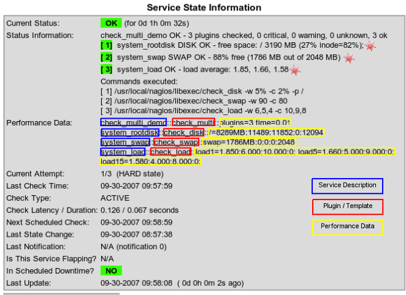

# Performance data

## Multi performance labels

Basically the check_multi performance data format follows the performance data format described in the [Plugin API document](http://nagios.sourceforge.net/docs/3_0/pluginapi.html).\\
\\
In order to provide the performance origin information (plugin type) to performance data interpreters the performance *label* format has been extended:

#### Standard performance data:
```  
swap=1786MB;0;0;0;2048  
```
#### check_multi performance data:  
```  
system_swap::check_swap::swap=1786MB;0;0;0;2048  
``` 

The performance data can (and probably will) consist of a chain of performance data from the particular child plugins - each headed by a multi label. 

The performance data tool reads this multi label and interprets the following perf data als belonging to the child plugin specified in the multi label (see [example](configuration/performance.md) below)

The specification of the type of performance labels has to be done with the '-r' option (see [here](options#r_--report_level)). Multi performance labels need '-r 8' while standard performance labels have to be configured with '-r 32'. 

### Multi label format

| Multi Label         | :: | Plugin Name / Template | :: | Performance Data                      | 
| -----------         | -- | ---------------------- | -- | ----------------                      | 
| Service Description | :: | Plugin                 | :: | P-label=P-value [P-label=P-value] ... | 

### Examples

| Service Description | :: | Template   | :: | Performance Data             | 
| ------------------- | -- | --------   | -- | ----------------             | 
| disk_root           | :: | check_disk | :: | /=8286MB;11489;11852;0;12094 |   
| system_swap         | :: | check_swap | :: | swap=1786MB;0;0;0;2048       | 

## PNP: which template will be chosen?

PNP determines the template to use for the performance data depending on the plugin. 
Normally the plugin is the first token behind the equal-sign: ''command [ swap ] = **check_swap** ...''.


There are some special cases in which it is not clear which plugin is used: *check_nt* for example gathers performance date from different sources, but the plugin name remains *check_nt*.

*check_multi* provides a special type of tag ''command [ tag::plugin ]'' to solve this problem.

## Discard invalid performance data

Every childs performance data is checked on the correctness of format [(compare here)](http://nagiosplug.sourceforge.net/developer-guidelines.html#AEN203). If a child check provides incorrect performance data it will be discarded with an error message because it could corrupt the whole remaining performance data.

## Individual suppression of performance data

If you want some child checks *not* to show performance data, you can use [--set suppress_perfdata=tag1,tag2,...](configuration/options.md). 
You have to provide a comma separated list of tags which performance data should not be shown.

### Service Extinfo Example


