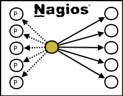
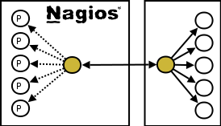

# check_multi feeds passive checks
  

Large environments are one of the major places to run *check_multi* in order to

* reduce the number of Nagios servers
* avoid the complexity of a distributed environment

On the other hand the *check_multi* has clear disadvantages (''There can be only one'') when 

* heterogeneous groups are participating in the monitoring
* one Nagios object is needed for every monitoring item (=check_multi child check).

This was the basic motivation for the improved implementation with

* the standard *check_multi* plugin as a active data collector
* an additional report mode which feeds all child results as passive checks into Nagios 

### Pros

* The communication between Nagios server and client happens only once per machine but not once per check.
* The multi check is active and therefore under Nagios scheduling control.
* Since the particular services are passive they do not put load on the Nagios scheduling queue.
* All services are nevertheless Nagios services, we have: Notification, Escalation, Reporting.
* The performance gain is enormeous: 25000 Services per server are possible (see Performance section).

### Cons

* More complexity compared to a active service implementation (but less than a distributed setup)
* The configuration has to be set up twice, one time for the active check_multi check, one time for the passive checks.

### Basic design

#### How does it work?
 1.  *check_multi* acts as a normal active Nagios check and collects checks from a remote host.
 2.  Each child check has a corresponding passive check in Nagios with the same name.
 3.  *check_multi* takes the child checks output and RC and feeds it into the corresponding passive Nagios check.

#### Implementation details
There is a design problem when executing multiple remote checks within one collector check and then return the results into the passive side of Nagios: the transport. 

*  If you run *check_multi* on the Nagios server, you need an remote connection for each child check: very expensive
*  If you run *check_multi* on the remote server, you have problems to reach Nagios input queue on the passive side.  

The solution is: use check_multi **twice** in a command chain:



 1.  check_multi on the remote hosts gathers data.
 2.  check_multi on the Nagios server feeds passive services.
The first check_multi passes its results via XML to the second one.

''Note:'' the whole chain is started on the Nagios server. In case of DMZ host monitoring no inbound connections are used.

### Remote examples

1.  SSH
```
check_by_ssh -H <hostname> -c '/path/to/check_multi -f multi.cmd -r 256' | check_multi -f - -r 8192+8+1
```
2.  NRPE
```
check_nrpe -H <hostname> -c check_multi -a '-f multi.cmd -r 256' | check_multi -f - -r 8192+8+1
```
3.  NSCA
```
check_nrpe -H <hostname> -c check_multi -a '-f multi.cmd -r 4096+8+1'
```

This method needs a running nsca daemon on Nagios server. Inbound connections are used, therefore this approach is *not* recommended for DMZ setups.

## mod_gearman

check_multi easily can be integrated into Sven Nierleins [mod_gearman](http://labs.consol.de/lang/de/nagios/mod-gearman/). 

mod_gearman is a NEB module which runs checks over a [gearman](http://gearman.org/index.php?id=protocol) scheduling framework and passes results back to Nagios. This allows thousands of checks pretty efficiently to be run within a single Nagios instance.

A specific client 'send_multi' is part of the mod_gearman package and can be used to feed the particular child check results into the gearman queues. 

This client is a small C binary and by far less resource consuming as if you call check_multi itself to pass checks into Nagios. 

#### Call example
```
$ check_multi -f multi.cmd -r 256 | \
   send_multi --server=`<job server>` --encryption=no --host="`<hostname>`" --service="`<service>`"
```

#### Neb module

*  If you want to use only check_multi and no other workers, you can achieve this with the following neb module settings

```
broker_module=/usr/local/share/nagios/mod_gearman.o \
   server=localhost \
   encryption=no \
   eventhandler=no \
   hosts=no \
   services=no \
   hostgroups=does_not_exist
```

*  Encryption is not necessary if you both run the check_multi checks and the nagios check_results queue on the same server.
  
  
## For the curious: example installation
This example installation is part of the sample-config directory in the *check_multi* package.


*Note*: it's a setup for one machine, there is no remote access included in the configuration.

For the basic understanding of the principle this does not matter anyway ;-)

**Receipt:**
 1.  download *check_multi*, latest SVN.
 2.  `./configure; make all`{bash}
 3.  `cd sample-config/feed_passive`{bash}
 4.  Install the feed_passive example files with the`make install-config`{sh}this will add a directory ''/path/to/nagios/etc/check_multi/feed_passive''.
 5.  add the feed_passive subdirectory as cfg_dir to **nagios.cfg**:`cfg_dir=/usr/local/nagios/etc/check_multi/feed_passive`
 6.  reload / restart Nagios: et voila :-P


  
*  Standard sizing is 10 Hosts with 10 feed services and 100 passive services
*  If you want to put more load on your system, go to `<nagiosdir>`/etc/check_multi/feed_passive'' and run `perl gencfg nhosts`{bash} then reload nagios.


### Prerequisites on the Nagios server

 1.  **mandatory - perl module XML::Simple**
   Install XML::Simple on Nagios server, either from your Linux distribution or directly from [CPAN](http://search.cpan.org/perldoc?XML::Simple). Its only needed for the receiving side (the Nagios server), the senders (remote clients) do not need XML::Simple.
 2.  **optional - nagios.cfg settings**

I recommend to set some attributes for performance tuning and to avoid unnecessary logging: 

| setting                         | comment                                                           | 
| -------                         | -------                                                           | 
| child_processes_fork_twice=0    | speeds up Nagios, one fork is enough                              | 
| free_child_process_memory=0     | Linux can free memory much faster than Nagios                     | 
| log_initial_states=0            | Otherwise each days log contains one unnecessary line per service | 
| log_passive_checks=0            | saves lots of space in the nagios.log                             | 
| use_large_installation_tweaks=1 | another performance boost (e.g. no summary macros                 | 

None of these attributes is mandatory, but it will speed up your infrastructure in large setups.

### check_multi command file

Just as an example, your mileage may vary ;)

```
#--- multi.cmd
command [ system_disk  ] = check_disk -w 5% -c 2% -p /
command [ system_load  ] = check_load -w 10,8,6 -c 20,18,16
command [ system_swap  ] = check_swap -w 90 -c 80
command [ system_users ] = check_users -w 5 -c 10
command [ procs_num    ] = check_procs
command [ procs_cpu    ] = check_procs -w 10 -c 20 --metric=CPU -v
command [ procs_mem    ] = check_procs -w 100000 -c 2000000 --metric=RSS -v
command [ procs_zombie ] = check_procs -w 1 -c 2 -s Z
command [ proc_cron    ] = check_procs -c 1: -C cron
command [ proc_syslogd ] = check_procs -c 1: -C syslogd

#--- avoid redundant states

state   [ WARNING      ] = IGNORE
state   [ CRITICAL     ] = IGNORE
state   [ UNKNOWN      ] = IGNORE
```

### check_multi active service definition

This service runs on the remote host and gathers data:

*  check_multi report option ''-r 256+4+1'':
    - Mandatory:      ''-r 256'' as XML output option
    - Recommended:    ''-r   4'' for ERROR output 
    - last not least: ''-r   1'' for detailed results in the status line
*  Example:

```
define service {
        service_description     multi_feed
        host_name               host1
        check_command           check_multi!-f multi_small.cmd -r 256+4+1 -v
        event_handler           multi_feed_passive
        check_interval          5
        use                     local-service
}
```

### Passive ''feeded'' service definition

*  Mandatory: ''passive_checks_enabled  1''
*  Mandatory: ''active_checks_enabled   0''
*  and the rest: YMMV
*  Example:
```  
define service {
        service_description     $THIS_NAME$
        host_name               $HOSTNAME$
        passive_checks_enabled  1
        active_checks_enabled   0
        check_command           check_dummy!0 "passive check"
        use                     local-service
}
```

You can *easily* generate these passive services via check_multi report mode 2048:
```
check_multi -f multi.cmd -r 2048 -s service_definition_template=/path/to/service_definition.tpl > services_passive.cfg
```

Hint: create a oneliner which loops over your hosts and generates bulk service check definitions. Whenever a host is added, you rerun your script and reload Nagios to put the new passive services into effect.


### Troubleshooting

*  if you see the message ''Passive check result was received for service '%s' on host '%s', but the service could not be found!'', you have to double check the passive service definitions.
*  If you want to test it with a XML file, you have to use a pipe, e.g.`cat test.xml | check_multi -f - -r 8192`.
*  Sometimes the error can be seen to specify the cmd file on the receiver side of the pipe, e.g. ''check_multi ... | check_multi -f - -f xyz.cmd''.

This lets you monitor your Nagios server, not the remote host. Please recall - the pipe has two parts:\\ - the sender part for the remote side, where the information is being gathered (-> input)\\ - the local receiver part on the Nagios server, where the information is presented (-> output).
(Hint: check_multi -f - reads from STDIN)

### Performance benchmarking

* Dual core Athlon X2/64 3600 with 1 GB RAM
* Nagios configuration:
   - 1000 hosts
   - 1000 active services
   - 25000 feeded passive services


#### SAR states
```
	# sar -u
	06:00:00 PM       CPU     %user     %nice   %system   %iowait     %idle
	06:00:01 PM       all     32.28      0.00     28.37      0.71     38.63
	06:10:01 PM       all     31.66      0.00     27.86      1.05     39.43
	06:20:31 PM       all     31.60      0.00     28.06      1.25     39.09
	06:30:01 PM       all     31.61      0.00     28.40      1.19     38.79
	06:40:01 PM       all     31.55      0.00     28.39      1.16     38.90
	06:50:01 PM       all     33.68      0.00     28.54      0.92     36.86
	
	# sar -q
	06:00:00 PM   runq-sz  plist-sz   ldavg-1   ldavg-5  ldavg-15
	06:00:01 PM         3       166      1.99      2.52      3.75
	06:10:01 PM         3       158      1.91      2.19      2.95
	06:20:31 PM         2       155      1.53      1.93      2.44
	06:30:01 PM         2       159      2.22      2.11      2.28
	06:40:01 PM         2       155      1.76      1.96      2.10
	06:50:01 PM         2       165      1.90      2.14      2.14
```

#### Nagiostats
```
	Nagios Stats 3.1.2
	Copyright (c) 2003-2008 Ethan Galstad (www.nagios.org)
	Last Modified: 06-23-2009
	License: GPL
	
	CURRENT STATUS DATA
	------------------------------------------------------
	Status File:                            /usr/local/nagios/var/status.dat
	Status File Age:                        0d 0h 0m 5s
	Status File Version:                    3.1.2
	
	Program Running Time:                   0d 1h 40m 5s
	Nagios PID:                             4112
	Used/High/Total Command Buffers:        0 / 0 / 4096
	
	Total Services:                         26001
	Services Checked:                       26001
	Services Scheduled:                     1001
	Services Actively Checked:              1001
	Services Passively Checked:             25000
	Total Service State Change:             0.000 / 7.760 / 0.327 %
	Active Service Latency:                 0.000 / 1.054 / 0.160 sec
	Active Service Execution Time:          0.300 / 3.266 / 0.917 sec
	Active Service State Change:            3.750 / 7.760 / 4.246 %
	Active Services Last 1/5/15/60 min:     187 / 988 / 1001 / 1001
	Passive Service Latency:                0.000 / 0.000 / 0.000 sec
	Passive Service State Change:           0.000 / 7.760 / 0.170 %
	Passive Services Last 1/5/15/60 min:    4694 / 24676 / 25000 / 25000
	Services Ok/Warn/Unk/Crit:              26001 / 0 / 0 / 0
	Services Flapping:                      186
	Services In Downtime:                   0
	
	Total Hosts:                            1002
	Hosts Checked:                          1002
	Hosts Scheduled:                        1002
	Hosts Actively Checked:                 1002
	Host Passively Checked:                 0
	Total Host State Change:                0.000 / 0.000 / 0.000 %
	Active Host Latency:                    0.971 / 2.042 / 1.366 sec
	Active Host Execution Time:             0.024 / 1.150 / 0.065 sec
	Active Host State Change:               0.000 / 0.000 / 0.000 %
	Active Hosts Last 1/5/15/60 min:        185 / 935 / 1002 / 1002
	Passive Host Latency:                   0.000 / 0.000 / 0.000 sec
	Passive Host State Change:              0.000 / 0.000 / 0.000 %
	Passive Hosts Last 1/5/15/60 min:       0 / 0 / 0 / 0
	Hosts Up/Down/Unreach:                  1002 / 0 / 0
	Hosts Flapping:                         0
	Hosts In Downtime:                      0
	
	Active Host Checks Last 1/5/15 min:     220 / 968 / 2906
	   Scheduled:                           220 / 968 / 2906
	   On-demand:                           0 / 0 / 0
	   Parallel:                            220 / 968 / 2906
	   Serial:                              0 / 0 / 0
	   Cached:                              0 / 0 / 0
	Passive Host Checks Last 1/5/15 min:    0 / 0 / 0
	Active Service Checks Last 1/5/15 min:  200 / 1001 / 3003
	   Scheduled:                           200 / 1001 / 3003
	   On-demand:                           0 / 0 / 0
	   Cached:                              0 / 0 / 0
	Passive Service Checks Last 1/5/15 min: 4975 / 25000 / 75000
	
	External Commands Last 1/5/15 min:      0 / 0 / 0
```